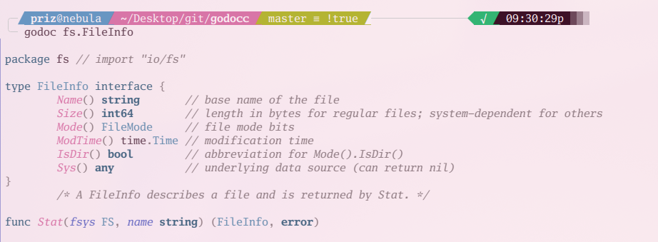

# godoc

Like `go doc` but with colors.

## Installation

```
$ go install github.com/VoxelPrismatic/godoc@latest
```

## Usage

Accepts all the arguments and flags `go doc` works with. Godoc is just a simple wrapper around the go doc tool.

Example:

```sh
$ godoc io.Writer
```


```sh
$ godoc os.WriteFile
```


```sh
$ godoc github.com/tree-sitter/go-tree-sitter.CaptureQuantifierZero
```


```sh
$ godoc fs.FileInfo
```



## Styling

Unlike other forks of `godocc`, this uses TreeSitter for the sole purpose
of using your terminal's highlighting. Absolutely no color or styling customization
is provided in the command line; just your standard ANSI colors.
